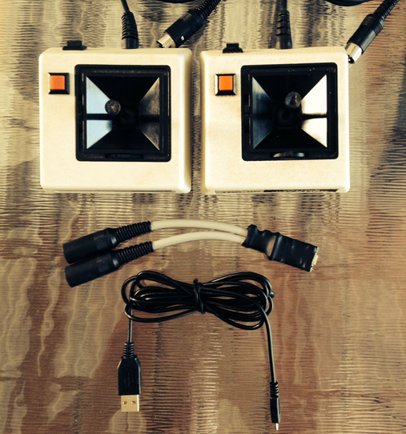
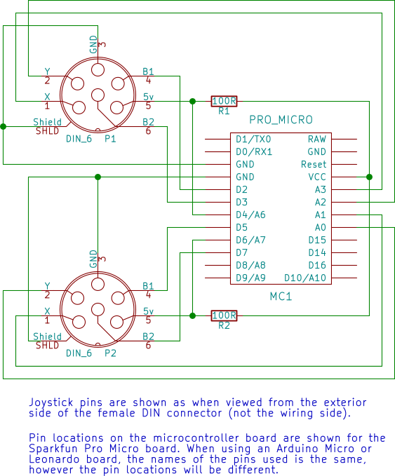
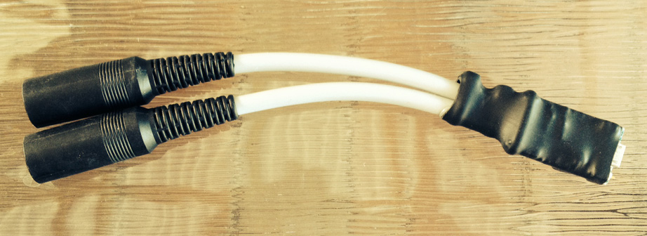

TandySticks
===========

Arduino Micro adaptor that converts vintage Tandy Joysticks to USB HID devices.

*Anyone may use this software and design. Most of this project is placed into the public 
domain, however please note that Joystick2.h and Joystick2.cpp are LGPL licensed.
All content is provided as-is and is used at your own risk. See LICENSE for full details.*

*The prototype adapter was built using a very inexpensive Pro Micro clone microcontroller
board purchased through eBay. Some later investigation discovered that the price, including
postage, is in fact less than the wholesale, volume pricing of just a single component 
(the ATMEGA32U microcontroller). If purchasing, consider that the source country may not 
offer the same recourse as your country in the event of damages relating to a possibly 
counterfeit or defective product.*

*Even when using microcontroller boards from other sources, keep in mind that these devices
are intended for tinkerers, and that the circuit design included here is a lightly tested
prototype. At a minimum, it is not recommended to leave the adaptor connected to a 
computer while unattended.* 

Overview
--------

This adapter is built using an Arduino Micro or compatible microcontroller board.
The prototype used for testing was built using a Sparkfun Pro Micro clone, which 
is software compatibe with the Arduino Micro, however physical pin locations differ.
An Arduino Leonardo board could also be used.

This software has been tested to work with the VCC emulator, XRoar emulator and MAME.
MAME testing was done on several arcade games only - no Tandy computer emulation was tested.

This software performs filtering to reduce the effects of analog axis noise, button bounce
and false disconnects. When a physical joystick is not connected to the adapter, a joystick 
still shows as being connected on the host computer. However the joystick values will be 
locked to dead center.

Performance varies with individual joysticks. During development, two Tandy Deluxe Joystick's
were used. One joystick performed very well, with little jitter, although did not consistently
register full top left. The second would only output a partial left, and the output in that
position was extremely jittery. In some Coco games, such as Sailor Main, it was not possible 
to reliably move left with this joystick. 

Cleaning a joystick's potentiometers with contact cleaner may improve performance. Alternatively, 
calibrating the joystick limits in Windows may provide a solution for poorly performing joysticks.

Building the Circuit
--------------------

Follow the connections on the schematic. All joystick connections are wired directly to
the microcontroller board, except for the 5v connections which pass through 100 ohm resistors.
These resistors are required and must be wired correctly for the software to function 
properly. They form part of the joystick connected/disconnected detection method.

The prototype was wired directly onto a Pro Micro board, then secured with zip ties and
heat shrink tubing. This approach is time consuming and prone to short circuits - it is 
perhaps best to use only for one-off construction. The circuit would be safer and much
faster to construct when realized on a printed circuit board using PCB-mount connectors,
to then be fitted into a small box enclosure.

Programming the Board
---------------------

1. Download and install Arduino software 1.6.6 or later.
2. Open the TandySticks.ino sketch in the Arduino editor.
3. Connect the board/adapter 
4. Under the Tools menu, select the microcontroller board being used. When using the
   Sparkfun/clone Pro Micro board, choose Arduino/Genuino Micro.
5. Program the board by selecting Upload from the Sketch menu.
6. If the upload was successful, two new "HID-compliant game controller" devices
   will be detected (if running Windows).

Uploading a sketch to one of these boards for the first time can be error prone
and frustrating. Resetting the board just before starting the upload may be required.
The Pro Micro boards do not have a reset button - one may be temporarily wired
to the board across the RST and adjacent GND connections. Alternatively, the two 
connections may be carefully shorted with a piece of wire. Disconnecting and reconnecting 
the Pro Micro board at the right time may also work.

Often, the upload process will get stuck and can't be completed. If this happens, unplug
the board, close the Arduino software (all windows) and start over.

Testing the Adapter
-------------------

The adapter should work with any application that supports HID game controllers.

Under Windows, the adapter may be tested using the built in diagnostics and
calibration software:

1. From the Start menu, search for "joy.cpl".
2. When found, click "joy.cpl" to run it.
3. Two game controllers should be shown. They will have the the name of the microcontroller
   board selected, such as "Arduino Micro".
4. Double-click one of the listed controllers. A diagnostics dialog will open that allows
   testing the axis and two buttons.
5. With a physical joystick connected, moving the stick and pressing buttons should
   register on the screen. If no input changes are seen, the joystick is likely connected
   to the other controller. Either change the physical connection to the other socket,
   or close the diagnostics dialog and choose the other dialog.

FAQ
---

Q. It can be confusing which joystick is being used. Could the two joysticks have different
   labels in Windows, such as "Joystick 1" and "Joystick 2".

A. It is not trivial to change the name of devices using the Arduino software. Further,
   the order in which controllers appear in Windows, or software such as Mame, seems
   to be somewhat random. Attempting to apply fixed labels will likely lead to more confusion
   as "Joystick 1" appears as "Joystick 2" in some software.

Q. Why not use a Teensy board?

A. The use of a Teensy 2.0 board was originally intended. However the default Joystick 
   configuration provided by Teensy did not work well in MAME. Going left/up was impossible 
   and the default button mappings didn't match up with MAME's defaults. Changing the 
   configuration with Teensy was proving to be unreasonably complicated. On the other hand, 
   customizing the configuration of a Micro board is straightforward using Arduino 
   software 1.6.6 or later.

 